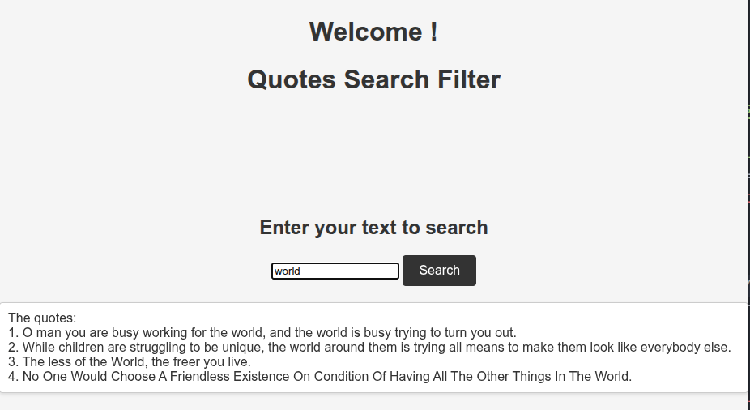
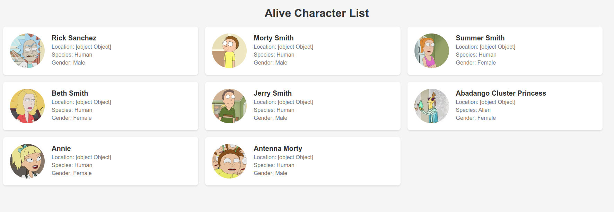

# JavaScript Projects Collection

A collection of JavaScript projects developed to practice core programming concepts, object-oriented programming (OOP), asynchronous programming, file handling, API integration, and DOM manipulation.

This repository contains several independent projects, each focusing on different JavaScript features and real-world use cases.

---

## Repository Structure

```text
JS_Projects/
│
├── TasksManagement/
├── QuoteSearch/
├── MoviesManagement/
├── HotelManagement/
└── FetchingAliveCharacters/
```

---

# Projects Overview

## 1. Tasks Management

A command-line TODO application built with Node.js that allows users to manage their daily tasks.

### Features

* Add new tasks
* View all tasks
* Mark tasks as completed
* List completed tasks
* Delete tasks
* Sort tasks by due date
* Assign priorities based on task deadlines
* Clear all tasks
* Interactive command-line menu

### Concepts Used

* Classes and Objects
* Private Class Fields
* Encapsulation
* Arrays and Array Methods
* Async/Await
* User Input with `readline`
* Basic Date Management

### Technologies

* JavaScript (ES6+)
* Node.js

---

## 2. Quote Search

A browser-based application that retrieves quotes from an external API and allows users to search through them.



### Features

* Fetch quotes from an online API
* Search quotes by keyword
* Case-insensitive filtering
* Dynamic result rendering
* Error handling for failed API requests

### Concepts Used

* Fetch API
* Asynchronous JavaScript
* DOM Manipulation
* Event Handling
* Array Filtering

### Technologies

* HTML
* CSS
* JavaScript

---

## 3. Movies Management

A command-line movie management system that stores movie information locally and supports CRUD operations.

### Features

* Display all movie titles
* Add new movies
* Edit movie information
* Delete movies
* Search movies by:

  * Title
  * Director
  * Genre
* Read and write movie data to JSON files
* Fetch movie information from an external API

### Concepts Used

* File System Operations (`fs`)
* JSON Data Storage
* Modular Programming
* Asynchronous Programming
* API Integration
* CRUD Operations

### Technologies

* JavaScript (ES6+)
* Node.js
* File System Module
* node-fetch

---

## 4. Hotel Management

An object-oriented hotel management simulation demonstrating inheritance and encapsulation principles.

### Features

* Create hotels and rooms
* Book rooms
* Display hotel advertisements
* List booked rooms
* Support different room types:

  * Standard Rooms
  * Sleeping Rooms
  * Rooms with View

### Concepts Used

* Object-Oriented Programming (OOP)
* Inheritance
* Encapsulation
* Polymorphism
* Private Class Fields

### Technologies

* JavaScript (ES6+)

---

## 5. Fetching Alive Characters

A JavaScript project focused on consuming external APIs and retrieving information about living characters.



### Features

* Fetch character data from an API
* Process API responses
* Display retrieved information
* Practice asynchronous programming techniques

### Concepts Used

* REST APIs
* Fetch API
* Promises
* Async/Await
* JSON Processing

### Technologies

* JavaScript
* Node.js

---

# Learning Objectives

These projects were developed to strengthen skills in:

* Modern JavaScript (ES6+)
* Object-Oriented Programming
* Asynchronous Programming
* API Consumption
* File Handling
* DOM Manipulation
* Error Handling
* Modular Application Design
* Command-Line Applications

---

# Getting Started

### Clone the Repository

```bash
git clone <repository-url>
cd JS_Projects
```

### Run a Project

Navigate to the desired project folder and follow its instructions.

Example:

```bash
cd TasksManagement
node index.js
```

---

# Author

**Sarah Abu Irmeileh**

Computer Science Graduate with interests in software development, computer graphics, and building practical applications using modern technologies.
